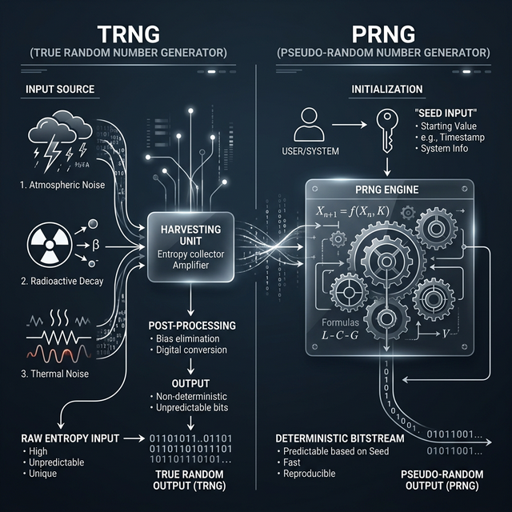
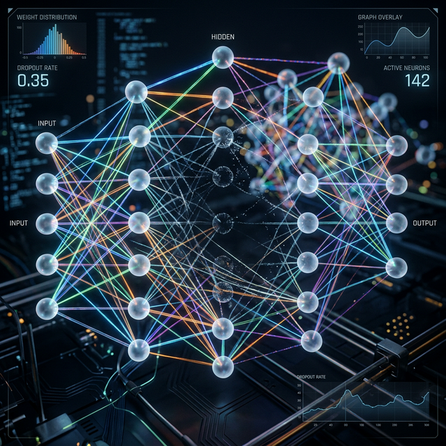

# The Architecture of Unpredictability: A Comprehensive Exploration of Computational Randomness

## Introduction: The Paradox of Deterministic Chaos

At the very heart of computer science lies a profound paradox: machines are strictly deterministic entities, engineered to transform a specific set of inputs into a highly predictable set of outputs. A CPU executing a sequence of instructions will, given the exact same initial state, yield the exact same result until the hardware literally melts. 

Yet, our modern digital existence demands the exact opposite of determinism. From the cryptographic handshakes that secure your bank transfers to the procedural generation shaping the vast landscapes of *Elden Ring*, computing relies inextricably on the concept of **randomness**.

> [!NOTE]
> Imagine attempting to build a perfect casino using only a complex system of gears and levers. No matter how intricate the clockwork, a sufficiently observant patron could eventually map the entire mechanism and predict the outcome of every spin of the roulette wheel. This is the fundamental challenge of computational randomness.

This report deconstructs the architecture of unpredictability. We’ll dissect the foundational differences between true entropy and algorithmic mimicry, explore the mathematical engines powering specific random number generators, and look at the catastrophic consequences when "random" isn't random enough.

---

## The Primordial Soup of Computing: TRNGs, PRNGs, and Entropy

To understand how a computer generates a random number, one must first distinguish between the two primary methodologies of randomness: **True Random Number Generators (TRNGs)** and **Pseudo-Random Number Generators (PRNGs)**. 



### True Random Number Generators (TRNGs): Harvesting the Universe

A TRNG does not rely on algorithms; instead, it harvests randomness from the physical universe. Because the macroscopic and quantum worlds are inherently noisy and unpredictable, TRNGs measure this chaos and digitize it into binary data.

Common sources include:
- **Quantum Fluctuations:** Measuring the "boiling sea" of virtual particles in a vacuum.
- **Radioactive Decay:** Utilizing the unpredictable time intervals between the emission of particles.
- **Atmospheric Noise:** Capturing radio static generated by global lightning strikes.

TRNGs are the gold standard for long-term cryptographic keys, but they are slow and expensive. You can't just "ask" a TRNG for a billion numbers a second without stalling your system.

### Pseudo-Random Number Generators (PRNGs): The Illusion of Chaos

To solve the throughput problem, we use PRNGs. A PRNG is a purely mathematical algorithm that takes a starting value, known as a **seed**, and applies complex transformations to produce a sequence of numbers that *appear* random.

Think of a PRNG as a massive, intricately designed hedge maze. If two people enter through the exact same entrance (the seed) and follow the exact same rules, they will trace the exact same path. It looks chaotic to someone inside, but it's rigidly predetermined.

---

## The Entropy Pool: The Culinary Stew of Chaos

If TRNGs are slow and PRNGs are deterministic, how does a modern OS stay secure? The answer is the **Entropy Pool**.

The operating system kernel behaves like a digital scavenger, monitoring unpredictable events:
- **Keystroke Timings:** The microsecond intervals between your 'H' and 'E' key presses.
- **Disk Latency:** The irregular spin-up times and seek latencies of mechanical drives.
- **Network Jitter:** The microscopic delays between incoming packets from a server in Singapore.

The kernel digitizes these fragments of chaos and "stirs" them into a buffer-the entropy pool-using strong cryptographic hash functions like **BLAKE2s**. 

> [!TIP]
> Think of the entropy pool as a massive industrial blender. Even if an attacker knows you just added a "carrot" (a single keystroke), once the blender starts, the carrot is atomized and irreversibly mixed with everything else. You can't "un-blend" the soup to find the original state.

---

## Deep Dive: Randomness in Artificial Intelligence

Randomness isn't just for security; it's the lifeblood of modern Deep Learning. Without it, your Neural Networks would be stuck in a permanent state of "mediocrity."



### Weight Initialization: Breaking Symmetry
When you initialize a Neural Network, you cannot set all weights to zero. If you did, every neuron in a layer would calculate the exact same gradient during backpropagation, and they would all update identically. The network would effectively be a single neuron repeated thousands of times.

We use **Random Weight Initialization** to "break symmetry":
- **Xavier (Glorot) Initialization:** Keeps the variance of activations and gradients consistent across layers.
- **He Initialization:** Tailored for ReLU activation functions to prevent "dead neurons."

### Dropout: The Random Eraser
During training, we randomly "kill" neurons in each pass. This forces the network to learn redundant representations and prevents it from becoming overly reliant on a specific path, effectively acting as a powerful **regularization** technique.

---

## A Bestiary of Algorithms: The Evolution of Mathematical Trickery

The mathematical engines driving PRNGs have evolved through a continuous arms race.

### 1. Linear Congruential Generators (LCG): The Grandfather
Created in the 1950s, the LCG is simple and fast.
```c
// A classic LCG implementation
uint32_t next_random(uint32_t current_state) {
    return (1103515245 * current_state + 12345) % 2147483648;
}
```
**The Flaw:** When plotted in multi-dimensional space, LCG outputs align on parallel "hyperplanes." This geometric bias makes them unsuitable for complex simulations.

### 2. The Mersenne Twister (MT19937): The Giant
The reigning champion for decades, MT19937 has an astronomical period (2^19937 - 1). 
**The Flaw:** It has a massive state (2.5KB) and is **not** cryptographically secure. 

> [!CAUTION]
> **State Recovery Attack:** If an attacker observes 624 consecutive outputs from a Mersenne Twister, they can reconstruct its entire internal state and predict every future number with 100% accuracy.

### 3. Xoshiro256++: The Speed Demon
The modern standard for non-cryptographic tasks. It's blazingly fast and statistically robust, though still linear and thus predictable if you know how to look.

### 4. ChaCha20: The Cryptographic Standard
A stream cipher used for absolute unpredictability. It's fast (especially with SIMD optimization) and computationally infeasible to crack.

| Algorithm | Speed | Security | Best Use Case |
| :--- | :--- | :--- | :--- |
| **LCG** | Lightning | None | Legacy / Tiny MCUs |
| **MT19937** | Moderate | None | Scientific Research |
| **PCG64** | Fast | Difficult | Modern Games (Rust/C++) |
| **ChaCha20** | Very Fast | **Strong** | Cryptography / Web Traffic |

---

## The Language Landscape: A Comparative Analysis

Different programming languages approach randomness with varying degrees of "paternal instincts." Some let you play with loaded dice (legacy C), while others force you to wear a digital hazmat suit (modern Rust/Go).

### 1. C++: The Toolbelt of the Brave
C++11 finally replaced the ancient `rand()` with a proper library, but it still expects you to know what you're doing. If you use `std::mt19937` for a bank login, you're basically leaving the vault door open but painting a "No Entry" sign on it.

```cpp
#include <random>
#include <iostream>

int main() {
    // Non-cryptographic (PRNG)
    std::mt19937 generator(42); // Seeded with 42 (predictable!)
    std::uniform_int_distribution<int> distribution(1, 100);
    std::cout << "PRNG: " << distribution(generator) << std::endl;

    // Proper Hardware Entropy
    std::random_device rd; 
    std::cout << "Entropy: " << rd() << std::endl;
}
```

### 2. Rust: The Safety Inspector
Rust’s `rand` crate is the gold standard. It uses **ChaCha12** by default, meaning even the "basic" generator is cryptographically robust enough to handle most security tasks.

```rust
use rand::prelude::*;

fn main() {
    // Thread-local, auto-seeded from entropy pool
    let mut rng = thread_rng();
    let x: u32 = rng.gen();
    println!("Safe Random: {}", x);
}
```

### 3. Go: The Pragmatic Architect
Go 1.22 made the bold move of automatically seeding `math/rand` from a cryptographic source if you don't provide one. It's Go's way of saying, "I know you're going to forget to seed this, so I did it for you."

| Language | Default PRNG | CSPRNG Access | Safety Rating |
| :--- | :--- | :--- | :--- |
| **C++** | `mt19937` | `std::random_device` | ⚠️ Hands-on |
| **Rust** | `ChaCha12` | `OsRng` | ✅ Paranoid |
| **Go** | `ChaCha8` | `crypto/rand` | 🛡️ Practical |
| **JS** | `xorshift128+`| `crypto.getRandomValues`| 🌐 Browser-bound |
| **Python** | `MT19937` | `secrets` | 🐍 Simple |

---

---

## Real-World Disasters: When Randomness Fails

### The Ferrenberg Affair (1992)
Researchers Alan Ferrenberg and D.P. Landau were simulating magnetism. Their PRNG (R250) had subtle "triplet correlations" that manifested as a phantom physical force. The simulation showed magnets behaving in ways that violated the laws of physics-all because the "random" numbers had a hidden geometric pattern.

### Breaking V8's Math.random()
Until late 2015, Google's V8 engine used a generator called MWC1616. Because it was linear in **Galois Field 2 (GF(2))**, an attacker could use a mathematical tool called an **SMT Solver** (like Z3) to reverse-engineer the internal state from just a few outputs.

---

## The Architecture of Memory: Predictability vs. Chaos

Randomness isn't just about numbers; it's about **where** data lives. If an attacker knows your password is at memory address `0x7ffee6a64a40`, your security is a joke.

### ASLR: The Ultimate TRNG for Memory
**Address Space Layout Randomization (ASLR)** is the reason why your programs don't crash every time a hacker breathes on them. Every time you run an app, the OS throws the stack, heap, and libraries into a digital blender and scatters them across the memory map.

- **Without ASLR:** Your code is a fixed target.
- **With ASLR:** Your code is a moving target inside a pitch-black room.

### Pointers vs. References: The Predictability Gap
- **Pointers (C/C++):** A raw pointer is an invitation to chaos. It exposes the actual memory address. If you can predict the RNG that generates the pointer's location, you can bypass ASLR entirely.
- **References (Java/C#/Python):** These are "abstractions." You don't get the address; you get a "handle." The runtime manages the actual location, adding a layer of **architectural unpredictability** that makes memory-corruption attacks significantly harder.

> [!IMPORTANT]
> **Rust's Ownership:** Rust takes this a step further. By enforcing strict ownership and borrowing at compile time, it eliminates the *need* for some of the chaos. It makes memory access **predictable for the developer** but **unpredictable for the exploiter**.

---

## End-to-End: The Anatomy of a Secure Transaction

Ever wondered what happens when you click "Generate API Key"? It's a journey from the physical world to the digital void.

1. **The Scavenge:** The Linux kernel detects you wiggling your mouse. This adds 3 bits of entropy to `/dev/urandom`.
2. **The Bloom:** The Hardware RNG (Intel RDRAND) fires a pulse of thermal noise.
3. **The Blend:** The kernel mixes the mouse wiggle and the thermal noise into a CSPRNG pool.
4. **The Call:** Your Python backend calls `secrets.token_hex(32)`. 
5. **The Unpredictability:** You get `7f8a1...`. Even if an attacker saw your screen, they couldn't guess the next bit without a crystal ball (or a quantum computer).

---

---

## The Future: Quantum Randomness and Post-Quantum Security

As we enter the era of Quantum Computing, the stakes for randomness are higher than ever.

### Quantum Randomness as a Service (QRaaS)
We are now seeing the rise of QRaaS. By firing lasers into a vacuum and measuring the resulting fluctuations, companies like the Australian National University can provide "True Quantum Randomness" via an API.

### Lattice-Based Cryptography
Post-quantum cryptography relies on the "Learning With Errors" (LWE) problem, which is essentially about finding "short" vectors in a high-dimensional lattice. These problems are resistant to both classical and quantum attacks, but they require massive amounts of high-quality randomness to generate their keys.

---

## Conclusion

The success of computational randomness lies in its ability to perfectly disguise the rigid, predictable order of the machine beneath a flawless illusion of chaos. From the kernel-level scavenging of keyboard noise to the quantum-mechanical measurement of vacua, our digital world is built on a foundation of "stochastic magic."

**Stay unpredictable.**
