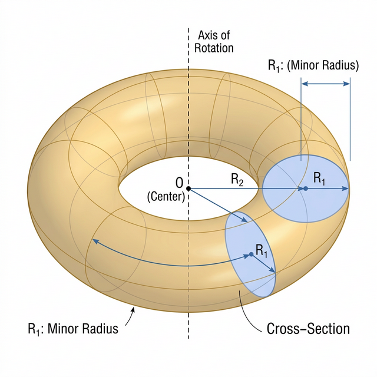

# Donuts, Math, and ASCII: The Geometry of a Spin

Have you ever looked at a terminal and thought, *"You know what's missing? A delicious, spinning, 3D donut made entirely of punctuation marks."* 

No? Just me? Well, regardless of your culinary-computational preferences, the **ASCII Donut** (originally created by Andy Sloane) is a masterpiece of "minimalist" engineering. It’s a beautiful blend of trigonometry, projection physics, and the kind of obsession that only a programmer at 3 AM can truly appreciate.



Today, we're going to break down how this works-from a circle in 2D to a spinning masterpiece in your CLI.

---

## 1. The Torus: A Donut's True Identity
In mathematics, a donut is called a **Torus**. To build one, we don't use flour and sugar; we use **Parametric Equations**.

Imagine a circle of radius $R_1$ centered at $(R_2, 0, 0)$. Now, spin that circle around the Y-axis. Voila! You have a torus.

The coordinates $(x, y, z)$ of any point on our donut can be found using two angles:
- $\theta$: The angle around the "tube" of the donut.
- $\phi$: The angle around the center of the donut.

$$
\begin{aligned}
x &= (R_2 + R_1 \cos \theta) \cos \phi \\
y &= (R_2 + R_1 \cos \theta) \sin \phi \\
z &= R_1 \sin \theta
\end{aligned}
$$

In our code (see `AsciiDonut.tsx`), we use these exact formulas to map out the surface of the donut. We just iterate through $\theta$ and $\phi$ from $0$ to $2\pi$.

---

## 2. Making It Spin (The Dance of Matrices)
A static donut is a sad donut. To make it spin, we need **Rotation Matrices**. 

We rotate the donut around two axes ($X$ and $Z$) using angles $A$ and $B$. Every time our animation frame updates, we increment $A$ and $B$, and the donut performs its hypnotic dance.

```typescript
// A and B are our rotation angles
const c = Math.sin(i); // i is theta
const d = Math.cos(j); // j is phi
const e = Math.sin(A);
const f = Math.sin(j);
const g = Math.cos(A);
// ... [Math Magic Continues] ...
```

---

## 3. Projection: 3D Donut, 2D Screen
Now comes the tricky part. Your terminal screen is flat (2D), but our donut is chunky (3D). How do we squash it without losing the "donut-ness"?

We use **Perspective Projection**. 

Points further away from the "camera" (large $z$) should look smaller. We calculate a projection factor $D$:
$$D = \frac{1}{z + K}$$
Where $K$ is the distance from the viewer. We then multiply our $(x, y)$ coordinates by $D$ to get the final position on your screen.

---

## 4. Shading: The ASCII Secret Sauce
How do we know which part of the donut is "bright" and which is "dark"? We calculate the **Surface Normal** (the direction the surface is facing) and compare it to a virtual light source.

If the surface is facing the light, we use a "bright" character like `@`. If it's facing away, we use a "dim" character like `.`.

The resulting string `.,-~:;=!*#$@` gives us a full range of 12 levels of luminosity.

---

## The Code Behind the Magic
If you look at the `AsciiDonut.tsx` component in this portfolio, you'll see this logic in action. It's not just a loop; it's a mathematical symphony that calculates thousands of points per second to keep that donut buttery smooth.

> [!TIP]
> Try scrolling or moving your mouse while viewing the donut on the homepage. You'll notice the math reacts to you, scaling and rotating based on your interaction!

---

## Conclusion
The ASCII Donut is a reminder that even with simple characters and basic trigonometry, we can create something complex and beautiful. It's the "Hello World" of 3D graphics, and it's still as cool today as it was years ago.

Now, if only I could figure out how to make it taste like cinnamon...

---
*Created with Gemini and a lot of Math.*
