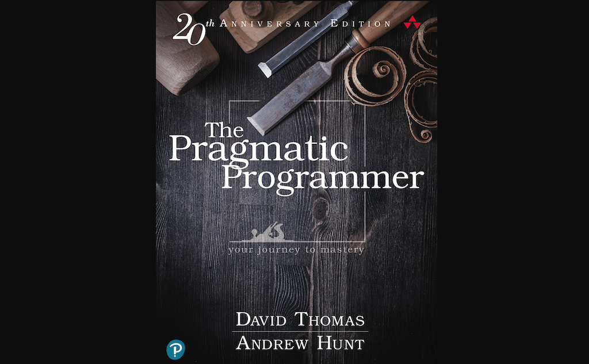
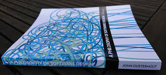
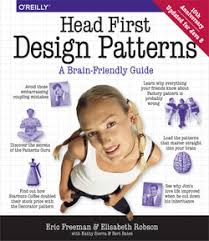
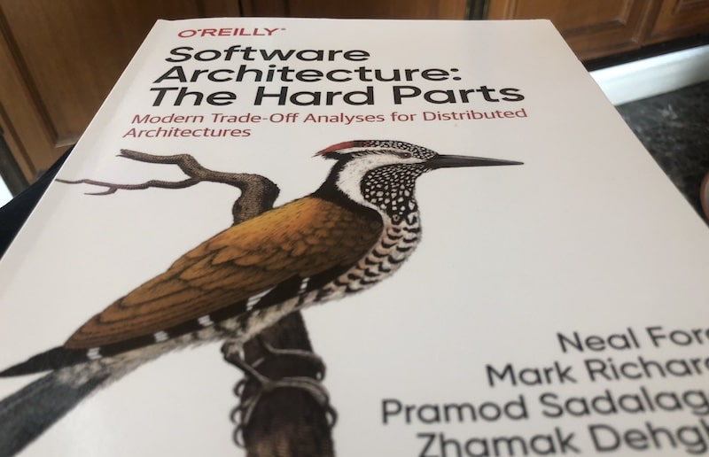
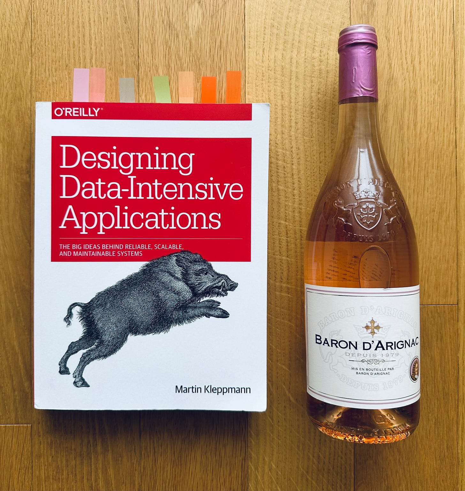
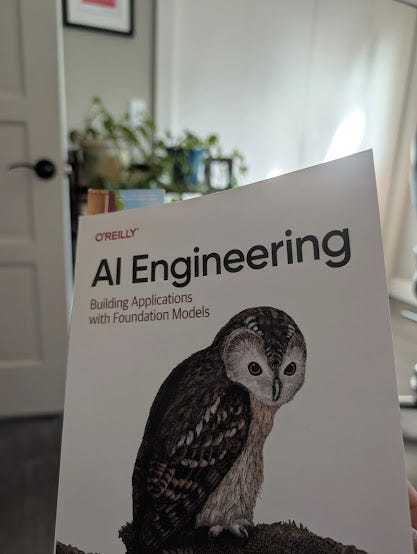

# The 2026 Developer's Bookshelf: What to Read (and What to Skip)

Let’s be honest: your "To Read" pile is probably taller than your actual bookshelf at this point. And with the 2026 AI-driven chaos we're living in, it’s harder than ever to tell what's actually worth your time versus what's just hype-cycle filler.

I’ve spent the last few months digging through updated 2026 libraries (shoutout to Edmond Lau), developer blogs like WATA Factory and Travis Media, and those legendary Reddit threads where people argue for 40 hours about whether *Clean Code* is still relevant.

This isn’t a "top 5" list. It’s a curated collection of classics that built our craft and brand-new 2026 picks that will keep you from being replaced by a shell script.

---

## 🏗️ 1. Coding Craftsmanship & Mindset
*The "Write Code You Won't Hate in 6 Months" Section*

These books fix your habits. They are timeless, but here’s why they are still my #1 recommendations right now.

### **The Pragmatic Programmer (20th Anniversary Edition)** – Andrew Hunt & David Thomas

**Why lead with this?** It’s the developer’s bible. It covers everything from thinking like an engineer to dealing with the influx of AI tools without losing your soul. Concepts like "tracer bullets" and "DRY" are more relevant than ever when LLMs are generating 40% of our boilerplate.

> [!NOTE]
> **Community Vibe:** Reddit and HN consensus is that this book holds up perfectly-better than almost any other classic. It’s a manifesto for professionals.
> 
> **Personal Take:** Start here. It’s funny, wise, and makes you feel like a wizard. Warning: after reading this, you *will* judge your old code like it’s a bad ex.

### **A Philosophy of Software Design** – John Ousterhout

**The Pitch:** It’s short, profound, and focuses on the real enemy: **Complexity**. While most books tell you *how* to write code, Ousterhout tells you *why* simple modules are the difference between a project that survives 2026 and one that dies in legacy hell.

> [!TIP]
> Read this after *Pragmatic Programmer*. It’s a game-changer for mid-level devs looking to step into senior roles. 

---

## 🎨 2. Design Patterns & Architecture
*Stop Copy-Pasting from Stack Overflow.*

### **Head First Design Patterns** – Eric Freeman et al.

**The Vibe:** This book is like learning from a chill uncle who draws memes. Visual, story-based, and surprisingly deep. It makes patterns like Singleton, Observer, and Factory stick in your brain forever.

> [!IMPORTANT]
> If you're a junior or just joined a new team, this is the cheat code for understanding how "senior" systems are actually built.

### **Software Architecture: The Hard Parts** – Mark Richards & Neal Ford

**Why now?** Distributed systems are messy. This book tackles the stuff that actually hurts: trade-offs, modularity, and tech debt in a cloud-first world.

---

## 🚀 3. Systems Design & Data-Intensive Apps
*The "Scale to Millions" Core.*

### **Designing Data-Intensive Applications** – Martin Kleppmann

**The GOAT.** If you haven't read "The Boar Book" yet, stop reading this blog and go buy it. It explores the deep dive into databases, consistency, partitioning, and streaming. 

> [!CAUTION]
> This book is dense. Don’t try to eat the whole thing at once-it’s like eating plain oats if you don’t take your time. But once you finish it, interviews and system design feel like playing on easy mode.

---

## 🤖 4. AI, LLMs & Future-Proofing
*Because 2026 = AI Everywhere.*

### **AI Engineering** – Chip Huyen

**The News:** Don’t just "chat with GPT." Build systems that *use* it. Chip Huyen covers the literal engineering side-from RAG and agents to productionizing foundation models. It's the most "future-proof" book in this list.

---

## 📜 The "Papers" Section: The Original Wisdom
Books are great, but these short papers (10-20 pages) are where the real secrets live. Aim for 1-2 per month.

| Paper | Why it Matters in 2026 | Link |
| :--- | :--- | :--- |
| **On the Criteria... Decomposing Systems (1972)** | The foundation of modularization. Microservices 101. | [PDF](https://www.cs.umd.edu/class/spring2003/cmsc838p/Design/criteria.pdf) |
| **Reflections on Trusting Trust (1984)** | A wild security lesson on compilers. Paradoxical and brilliant. | [PDF](https://www.cs.cmu.edu/~rdriley/487/papers/Thompson_1984_ReflectionsonTrustingTrust.pdf) |
| **A Note on Distributed Computing (1994)** | Why RPC isn't as simple as it looks. Still true in 2026. | [PDF](https://scholar.harvard.edu/files/waldo/files/waldo-94.pdf) |
| **MapReduce (2004)** | Big data foundation. Essential for understanding batch processing. | [PDF](https://static.googleusercontent.com/media/research.google.com/en//archive/mapreduce-osdi04.pdf) |
| **The Google File System (2003)** | How real-world scale works. Inspired almost everything we use now. | [PDF](https://static.googleusercontent.com/media/research.google.com/en//archive/gfs-sosp2003.pdf) |
| **Dynamo (2007)** | The blueprint for highly available key-value stores. | [PDF](https://www.allthingsdistributed.com/files/amazon-dynamo-sosp2007.pdf) |
| **Time, Clocks, & Ordering of Events (1978)** | Distributed time. Essential for understanding consensus and state. | [PDF](https://lamport.azurewebsites.net/pubs/time-clocks.pdf) |
| **What Every Programmer Should Know About Memory (2007)** | Performance secrets. Why Cache Locality is King. | [PDF](http://www.akkadia.org/drepper/cpumemory.pdf) |

---

## 🎯 My Personal 2026 Starter Pack
If you only have time for a few, read them in this order:

1. **The Pragmatic Programmer** (Mindset reset)
2. **Designing Data-Intensive Applications** (The technical heavy hitter)
3. **A Philosophy of Software Design** (Deep structural thinking)
4. **Head First Design Patterns** (Practical joy)
5. **One AI Paper** (Future-proofing)

**Stay curious, and stay unpredictable.**
